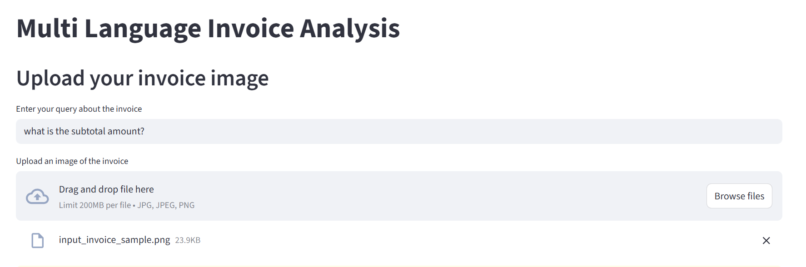
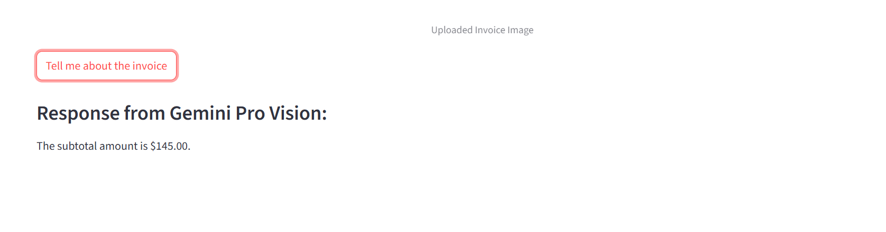

# 🧾 Multi-Language Invoice Analysis App

A Streamlit-based web application powered by Google's Gemini Pro Vision model to analyze and extract information from invoice images in multiple languages.

---

## 🎯 Objective

The goal of this project is to build an AI-powered assistant that:
- Accepts an uploaded **invoice image** in any language.
- Understands user queries about the invoice (e.g., "What is the total amount?" or "Who is the issuer?").
- Uses **Google's Gemini Pro Vision** model to analyze the invoice and generate human-like answers.

---

## ✨ Features

- 📤 Upload invoice images (`.jpg`, `.jpeg`, `.png`)
- 🌐 Multi-language support for invoice content and user questions
- 🤖 Natural language querying powered by Gemini Pro Vision
- 🧠 Context-aware response generation
- 💬 Streamlit-based UI for interactive usage

---

## ⚙️ Tech Stack

- [Streamlit](https://streamlit.io/) – Web interface
- [Google Generative AI](https://ai.google.dev/) – Gemini Pro Vision API
- [Python-dotenv](https://pypi.org/project/python-dotenv/) – Load API keys securely
- [Pillow (PIL)](https://pillow.readthedocs.io/en/stable/) – Image processing

---

## 📦 Installation & Setup

1. **Clone the repository:**

   ```bash
   git clone https://github.com/your-username/Multi-Language-Invoice-Analysis.git
   cd Multi-Language-Invoice-Analysis
2.  **Create and activate a virtual environment:**
    ```bash
    conda create -p venv python=3.10 y-
    conda activate ./venv
3. **Install dependencies:**
    pip install -r requirements.txt
4. **Set up your .env file:**
    Create a .env file in the project root:
    GOOGLE_API_KEY=your_actual_gemini_api_key_here
5. **Run the Streamlit app:**
    streamlit run app.py
---
## 📁 File Structure

Multi-Language-Invoice-Analysis/
├── app.py                # Main Streamlit app
├── .env                  # Environment variables (not committed)
├── requirements.txt      # Python dependencies
├── README.md             # Project documentation
└── demo_screenshot.png   # App screenshot

---
## 🧠 How it Works
The user uploads an invoice image and enters a query (e.g., "What is the due date?").

The app packages the image and query as input to Gemini Pro Vision.

Gemini analyzes the image context and answers the query using LLM-based reasoning.

---
## 🖥️ Demo

 <!-- 
 <!-- 

---